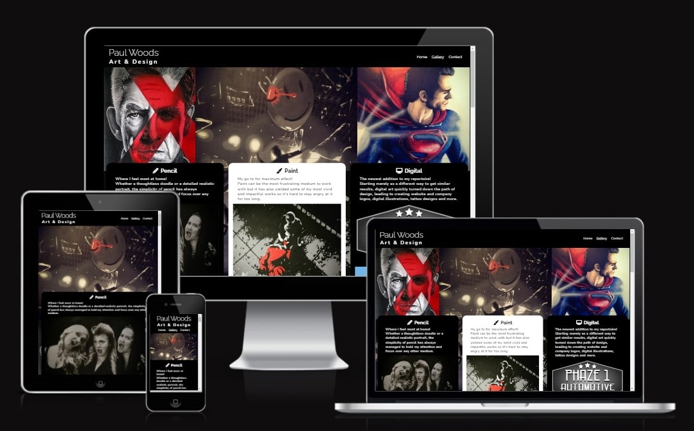
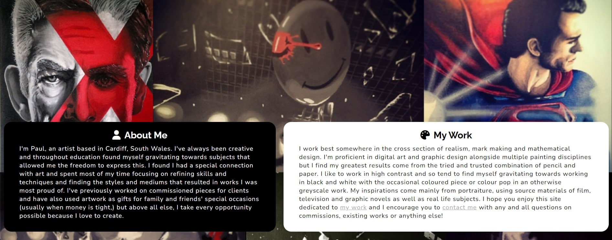
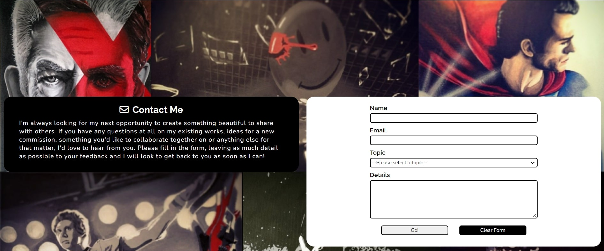
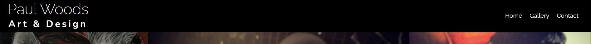
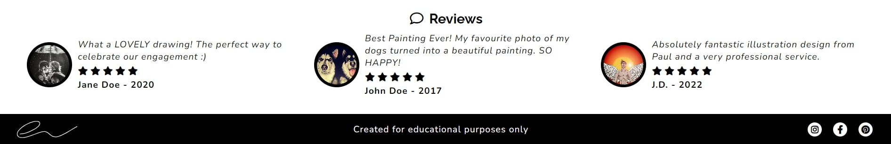
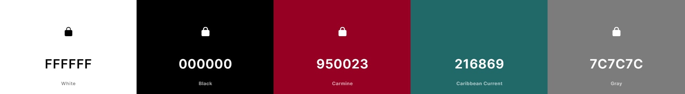
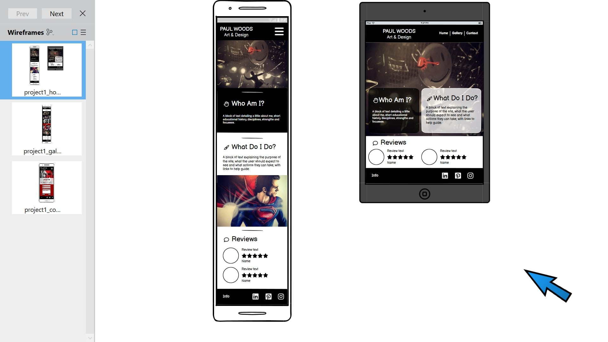

# Paul Woods - Art & Design
For this project, I wanted to design and develop an artists biography and gallery website using my own information and art as the content. I feel that working with my own content helped me to be more thorough along the entire process so as to present my artwork in the best possible light as well as create a webiste that I am proud of.

## Table of contents
- [Design](#design)
  - [User Stories](#user-stories)
    - [Current Features](#current-features)
    - [Future Features](#future-features)
  - [Colours](#colours)
  - [Wireframes](#wireframes)
  - [Fonts and Icons](#fonts-and-icons)
- [Development](#development)
  - [Languages](#languages)
- [Testing](#testing)
  - [Code and Performance Testing](#code-and-performance-testing)
- [Deployment](#deployment)
- [Credits](#credits)

## Design
### User Stories
The initial part of my planning was to decide who the site would be for and what experience they would expect to have from the site. I focued on the two situations below: 

1. Artist (Site Owner)
    - To showcase their artwork in the most professional, positive and user friendly way possible. 
    - To give some information on who they are and the artwork they undertake, including mediums used.
    - To offer a way to be contacted on a range of topics, including existing works and new comissions.

2. User looking to comission local artist for bespoke work (Site User)
    - Expectation to find a professional, easy to navigate site which promoted artwork as the main focus. 
    - To find information on the artist as well as a comprehensive view of artistic abilities.
    - To find an easily accessible means of reaching out to the artist for further information on comissions.

These user stories led me to list the features I would like to include on the site, of which, I then prioritised into a list from most important to least important based on the user stories I had deisgned. These you can see below, seperated into Current and Future Features.

#### Current Features
1. A gallery page displaying artwork under the headings of different mediums used.

2. A homepage offering artist and basic work information.

3. A contact page prompting user interaction.

4. A consistent navigational element for improved user experience.

5. A reviews section highlighting comments from previous recipients of artwork.

6. A footer linking to social media pages to encourage further interaction with artist.

#### Future Features
1. Add individual information to each image in the gallery, including sold status and price.
2. Further about me information including videos of studio workspace and creation processes.
3. Gallery event information including times, dates, locations, booking information etc.

### Colours
As the majority of the artwork is black and white with ocassional pops of bright colour (often red), I used [coolors.co](https://coolors.co/ffffff-000000-950023-216869-7c7c7c) to build on these three colours to form a usable and appealing colour palette and initially settled on the below:

Further into the design process, I decided to reduce this palette simply to black and white so as not to overwhelm the user experience and allow the artwork and information to be the primary focus of the site. I am happy with this decision and feel the finished site benifits from not having more colours added to the design. This also ensures a readable contrast between the text and section background colours in all areas of the site.

### Wireframes
With the premise of the site in place, including some basic deisgn ideas and features to include, I began by skecthing out designs for the different pages of the site, focussing on mobile first with a view to scaling up to bigger devices once I was happy with the smaller screen designs. I quickly moved on to using Balsamiq to aid my wireframe designing and found it massively helped me make desicions on the layout design of the site as a whole.

### Fonts and Icons
I searched through [Google Fonts](https://fonts.google.com/?preview.text=Paul%20Woods&preview.text_type=custom) using the page header (Artist name) to look for a font that would stand out as a heading and settled on Raleway is the interesting compostion of the "W" made the heading more aesthetically pleasing. I also then chose Nunito as the option for the primary text to add a different yet complimentary feel to the site text.

I also settled on using font awesome for the logos to go alongside each page sub-heading due to the effectiveness I had seen in previous walk-through projects. I was especially keen to use the star icons to show ratings in the reviews section. 

Both of these libraries were extremely easy to link to and integrate into the project and I feel they have added a huge amount to the overall design.

## Development

### Languages

## Testing

### Code and Performance Testing

## Deployment

## Credits