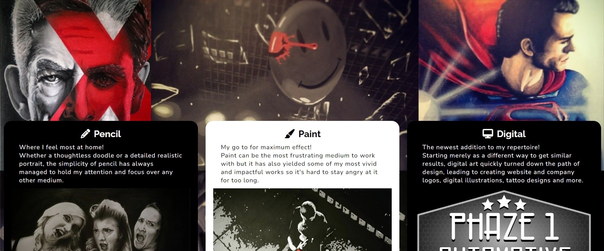

# Paul Woods - Art & Design
For this project, I wanted to design and develop an artists biography and gallery website using my own information and art as the content. I feel that working with my own content helped me to be more thorough along the entire process so as to present my artwork in the best possible light as well as create a webiste that I was proud of.


---
## Table of contents
- [Design](#design)
  - [User Stories](#user-stories)
    - [Current Features](#current-features)
    - [Future Features](#future-features)
  - [Colours](#colours)
  - [Wireframes](#wireframes)
  - [Fonts and Icons](#fonts-and-icons)
- [Development](#development)
  - [Languages](#languages)
  - [Media Queries](#media-queries)
- [Testing](#testing)
  - [Code and Performance Testing](#code-and-performance-testing)
- [Deployment](#deployment)
- [Credits](#credits)

---
## Design
### User Stories
The initial part of my planning was to decide who the site would be for and what experience they would expect to have from the site. I focued on the two situations below: 

1. Artist (Site Owner)
    - To showcase their artwork in the most professional, positive and user friendly way possible. 
    - To give some information on who they are and the artwork they undertake, including mediums used.
    - To offer a way to be contacted on a range of topics, including existing works and new comissions.

2. User looking to comission local artist for bespoke work (Site User)
    - Expectation to find a professional, easy to navigate site which promoted artwork as the main focus. 
    - To find information on the artist as well as a comprehensive view of artistic abilities.
    - To find an easily accessible means of reaching out to the artist for further information on comissions.

These user stories led me to list the features I would like to include on the site, of which, I then prioritised into a list from most important to least important based on the user stories I had deisgned. These you can see below, seperated into Current and Future Features.

#### Current Features
1. A gallery page displaying artwork under the headings of different mediums used.



2. A homepage offering artist and basic work information.


3. A contact page prompting user interaction.


4. A consistent navigational element for improved user experience.


5. A reviews section highlighting comments from previous recipients of artwork.


6. A footer linking to social media pages to encourage further interaction with artist.

#### Future Features
1. Add individual information to each image in the gallery, including sold status and price.
2. Further about me information including videos of studio workspace and creation processes.
3. Gallery event information including times, dates, locations, booking information etc.

### Colours
As the majority of the artwork is black and white with ocassional pops of bright colour (often red), I used [coolors.co](https://coolors.co/ffffff-000000-950023-216869-7c7c7c) to build on these three colours to form a usable and appealing colour palette and initially settled on the below:


Further into the design process, I decided to reduce this palette simply to black and white so as not to overwhelm the user experience and allow the artwork and information to be the primary focus of the site. I am happy with this decision and feel the finished site benifits from not having more colours added to the design. This also ensures a readable contrast between the text and section background colours in all areas of the site.

### Wireframes
With the premise of the site in place, including some basic deisgn ideas and features to include, I began by skecthing out designs for the different pages of the site, focussing on mobile first with a view to scaling up to bigger devices once I was happy with the smaller screen designs. I quickly moved on to using Balsamiq to aid my wireframe designing and found it massively helped me make desicions on the layout design of the site as a whole.


As can be seen above, the deisgn on smaller screens was planned to stack each section one above the other to give more real estate to each and lead the user to scroll through each page. This would then be spread into two columns at bigger screen sizes.

### Fonts and Icons
I searched through [Google Fonts](https://fonts.google.com/?preview.text=Paul%20Woods&preview.text_type=custom) using the page header (Artist name) to look for a font that would stand out as a heading and settled on Raleway as the interesting compostion of the "W" made the heading more aesthetically pleasing.


I also then chose Nunito as the option for the primary text to add a different yet complimentary feel to the site text.

I also settled on using [Font Awesome](https://fontawesome.com/) for the logos to go alongside each page sub-heading due to the effectiveness I had seen in previous walk-through projects. I was especially keen to use the star icons to show ratings in the reviews section. 

Both of these libraries were extremely easy to link to and integrate into the project and I feel they have added a huge amount to the overall design.

---
## Development
I began developing the project through Gitpod with the respository being stored on Github. Further into the project, the course migrated over to CodeAnywehere which caused some issues and bugs as documented later on. 

I initially began styling the page using Bootstrap but quickly found it frustrating to override classes and get the outcome I wanted so decided to push myself to write all the styling myself using CSS flex instead.

To cut down the development time, I began building this site by focussing on the elements that would be consistent across multiple pages:

- Header element with title and navigation menu fixed to the top of the screen at all sizes.
- Static hero image, created by fixing an image to the background of an empty section.
- Reviews section with thumbnail icons, review comments, star ratings, name and date.
- Footer including svg artist signature and social media links.

### Languages

- HTML5
- CSS3

### Media Queries
Once I was happy with the styling of the pages at mobile size, I used CSS media queries to change the layouts at different breakpoints:

- 576px and above - taken from the Bootstrap classes of small and medium.
- 992px and above - taken from the Bootstrap classes of large and extra large.

This ensured that at all device screen sizes, the layout would perform as expected, giving enough space to each element as can be seen in the comparison screenshots below:

- Gallery page at mobile screen size.


- Gallery page at desktop screen size.


- Reviews and footer sections at mobile screen size.


- Reviews and footer sections at desktop screen size.


As can be seen above, layout changes were made to the individual elements making up each page as outlined below: 

- Nav menu and page heading text are aligned to the centre with the nav menu underneath the header at mobile size. These move to one line and are spaced to either end of the header back on larger screens.

- Similarly with Footer elements, the social media link icons, educational sentance and signature are stacked and cetnrally aligned in that order on mobile. The order is then reversed on larger screens, pushing the signature out to the left and social links to the right.

- The individual reviews are also responsive, being vertically stacked on mobile, two with one centrally aligned below at small and medium screens and then all aligned horizontally on larger screens.

---
## Testing
Testing was initially carried out by myself on multiple devices and browsers including Google Chrome, Microsoft Edge and Firefox primarily using Google Dev Tools to check the media queries worked as expected.

Once I was happy that all pages performed as expected, I deployed to Github pages and sent the link along with a brief Google Form to friends, family and my class group on Slack to assess the user experience from genuine users on different platforms. All responses were extremely positive with only minor changes to be made on some of the functionality.

### Code and Performance Testing
I tested all .html files and .css file through W3C code vilidators and initially had the suggestion to consider removing the '/' at the end of void elements:
```
, <br>, <input>, <meta>, <link>
```
These were initially added automatically from the CodeAnywhere formatter (more on this in the [Bugs](#bugs) section.)

Aftr removing these, all files came back from the validators showing no issues.


Acting on advice from my mentor, I changed all the photo file formats to .webp to improve page performance and then spent some time using Lighthouse in Google Dev Tools for further opportunities to improve performance and check accessibility, best practice and search engine optimization scores. The below screenshot shows the home page score with all other pages scoring similarly well.


One noted issue was the reported need to set explicit height and widths on images which I initially added in an effort to improve performance but on review with my mentor, left out of the final version of the code to keep the HTML and CSS separate.

### Bugs
The main bug I encountered was the background hero image sizing at different breakpoints. The fixed background image worked well initialy on mobile but then when scaling up to desktop, the image was very stretched and unrecognisable. I overcame this by creating two different background images; a narrower collage for mobile and tablet and a wider collage for desktop size screen and implemented this to the background of the div element through the different media queries.

I also encountered a bug specifically on Firefox which pushed the signature in the footer too far into the page which made the layout look extremely odd. I fixed this by reviewing the CSS in the Firefox Dev Tools and amending the width value to fix the issue.

As noted previously, a big issue I faced was during the shift from GitPod to CodeAnywhere which came with a change in default formatter. This meant that using the formatter short cut would add in or reformat code which on review needed to be amended, lengthening the time to complete the project significantly.

---
## Deployment
The site was deployed to Github pages using the following steps to deploy:

1. From the Github repository for the project, [Project1 Repository](https://github.com/pawoods/project1), select the "Settings" option.
2. In the "Code and Automation" section, choose the "Pages" option.
3. Select "Deploy from a branch" from the "Source" menu.
4. Select "Main" from the "Branch" menu.
5. Click "Save" to confirm, the page will then be deployed.

Link to live site - [https://pawoods.github.io/project1/](https://pawoods.github.io/project1/)

---
## Credits
- I took initial layout inspiration from the previous walkthrough projects; Whisky Drop (Fixed background hero image) and Love Running (Page heading and nav menu)

- Credit also goes to the friends, family and Slack class group members who provided the feedback to fine tune my site.

- A big thank you also to my mentor, Martina, who provided a lot of valuable insight on how best to plan and execute my project, including catching the errors caused by the auto formatter.